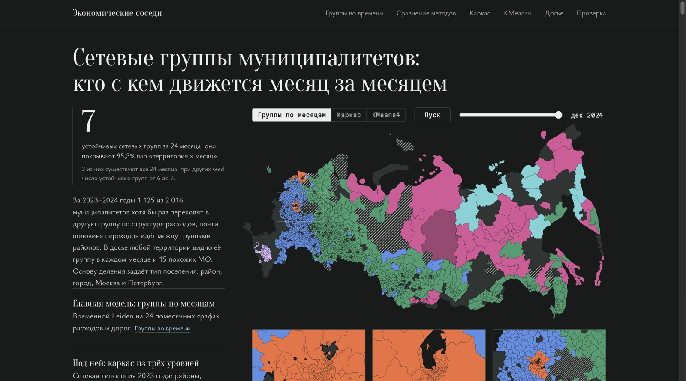
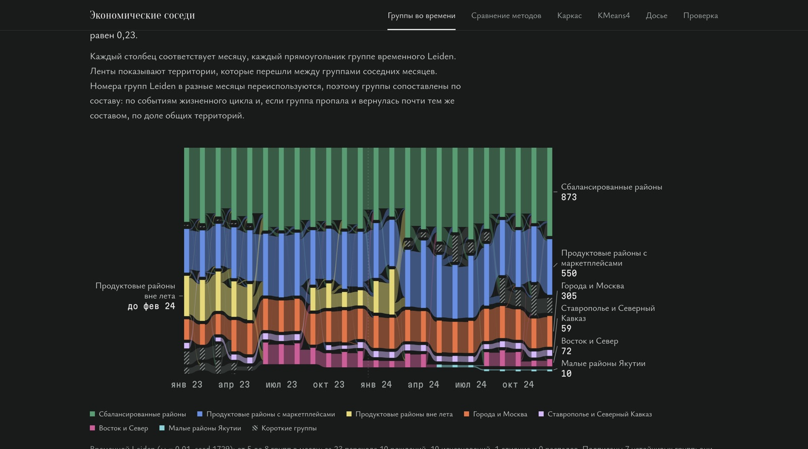
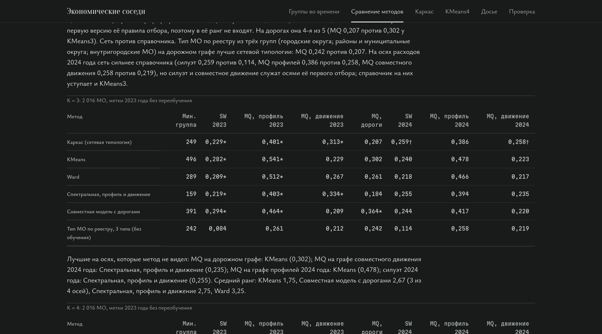
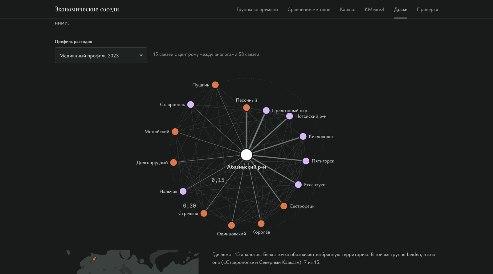

# Группы потребления

[](https://github.com/Egor2809/sberindex-clustering/actions/workflows/tests.yml) [](https://egor2809.github.io/sberindex-clustering/) [](LICENSE)

Я разбил 2 016 муниципальных образований (МО) на группы по тому, на что жители тратят деньги, и проследил, как эти группы меняются от месяца к месяцу в 2023–2024 годах. Данные: расходы СберИндекса по пяти категориям, сеть из сходства профилей и дорожной доступности, временной Leiden на 24 помесячных графах.

Автор: Егор Щеренко. Решение для номинации «Кластеризация» конкурса СберИндекса 2026.

**[Открыть атлас](https://egor2809.github.io/sberindex-clustering/)** · [отчёт](docs/REPORT_RU.md) · [презентация (PDF)](docs/presentation/presentation.pdf) · [воспроизведение](docs/REPRODUCE.md) · [где что лежит по критериям](#где-смотреть-по-критериям)

## Главное за минуту

1. **Семь групп потребления, три из них держатся все 24 месяца.** Города отличаются от средней тратами в общепите (+117 %), Север и Якутия покупают на маркетплейсах заметно меньше (−41 % и −61 %), Ставрополье и Северный Кавказ, наоборот, покупают больше всех (+30 %). Таблица ниже.
2. **Группы связаны с экономикой территорий.** Группа объясняет 58 % различий в зарплате между МО, которую модель не видела (η²; у KMeans4 46 %, у KMeans7 с тем же числом групп 50 %, у одного региона 77 %; разница с KMeans7 по бутстрэпу регионов от −0,3 до +17,8 п.п.). Индекс доступности рынков группы объясняют на 60 % против 45 % у KMeans7, разница значима (от +9 до +26 п.п.), но он отчасти связан с дорожным графом, на котором стоит сеть. Все 72 МО семи регионов, целиком относящихся к Крайнему Северу, хотя бы раз попадают в группы «Восток и Север» или «Малые районы Якутии» и проводят в них 48 % месяцев. Признака «Север» в модели нет, но географию она видит через дороги, а названия группам я дал по главному региону, поэтому это проверка смысла, а не независимое подтверждение ([расчёт](reports/temporal-groups/profiles.json)).
3. **Территории переходят между группами, и это видно по месяцам.** 1 125 МО из 2 016 (56 %) хотя бы раз меняют группу. Одна группа районов в 2023 году собиралась только вне лета и с марта 2024 года не появляется, а группа «Восток и Север» появляется в июне 2023 года. Её выделяет лето: по стране летом доля продуктов в тратах растёт на 0,73 п.п., а у ядра этой группы (136 МО) падает на 0,75 п.п., общепит растёт сильнее среднего (+0,81 против +0,50). Моя гипотеза: летом северяне уезжают в отпуск и тратят меньше на месте ([расчёт](reports/temporal-groups/profiles.json)). За 23 смены месяца группы 10 раз рождаются и 10 раз исчезают. Пример: Казачинско-Ленский район Иркутской области в сентябре 2023 года перешёл из «Сбалансированных районов» в «Продуктовые районы с маркетплейсами» и больше не возвращался; доля маркетплейсов в тратах жителей выросла с 8,2 % до 19,0 % (досье в атласе, поиск по названию).
4. **Аналоги из досье работают на практике.** 15 похожих МО, которые я подбираю по повторяющимся месячным связям, предсказывают рост расходов МО в 2024 году точнее, чем МО его же региона: ошибка 2,68 п.п. против 2,81, выигрыш 0,13 п.п., 95 %-интервал по регионам от 0,02 до 0,24 ([проверка](reports/type-validation/README.md)).

### Семь групп

Отличия от средней по всем парам «МО × месяц» считаю по правилу Миркина: (среднее доли в группе − общее среднее) / общее среднее. В таблице отличия от 20 % по модулю; у двух групп таких нет, для них показано наибольшее.

| Группа | Живёт, мес. | МО, бывавших в группе | Чем отличается от средней | Население, медиана | Зарплата 2023, медиана, ₽ |
|---|---:|---:|---|---:|---:|
| Сбалансированные районы | 24 | 1 110 | общепит −20 % | 19 641 | 49 745 |
| Продуктовые районы с маркетплейсами | 24 | 866 | общепит −39 %, маркетплейсы +24 % | 18 347 | 44 624 |
| Города и Москва | 24 | 359 | общепит +117 %, транспорт +24 %, продукты −25 % | 73 451 | 101 944 |
| Продуктовые районы вне лета | 11 | 610 | близки к средней, транспорт −18 % | 17 957 | 52 131 |
| Ставрополье и Северный Кавказ | 22 | 62 | маркетплейсы +30 %, здоровье +22 %, транспорт +21 % | 50 476 | 41 833 |
| Восток и Север | 16 | 279 | маркетплейсы −41 % | 21 100 | 81 839 |
| Малые районы Якутии | 8 | 28 | маркетплейсы −61 %, здоровье −38 %, транспорт −28 %, общепит +24 % | 9 062 | 103 340 |

Одно МО за два года может побывать в нескольких группах, поэтому сумма больше 2 016. Доли и медианы: [`reports/temporal-groups/`](reports/temporal-groups/).

**Как этим пользоваться.** В досье атласа для любого МО видно, в какой группе оно было каждый месяц, 15 похожих на него МО и 24 месяца его расходов. Так можно подобрать сравнимые территории для оценки программ и заметить, что у МО поменялась структура трат.



<p>



</p>

Атлас слева направо: группы по месяцам и переходы территорий между ними, сравнение методов на одних и тех же осях, досье территории с 15 аналогами.

## Одна модель и что вокруг неё

| Уровень | Что это | Зачем |
|---|---|---|
| Главная модель | Временной Leiden на 24 помесячных графах. Узел несёт профиль расходов месяца; половина веса рёбер у 15 ближайших по профилю, половина у графа дорожной доступности; одно МО в соседних месяцах связано ребром веса ω = 0,01 | отвечает на вопрос, какие группы есть в сети и как они меняются |
| Под ней | Годовой каркас из трёх уровней поселений: Leiden на графе 2023 года из профиля и совместного движения рядов | показывает, на какой устойчивой основе стоят помесячные группы |
| С чем сравниваю | KMeans4 и KMeans3 по годовому профилю, KEFRiN, справочник типов МО; всего 56 годовых разбиений | базовые линии для каждого вывода |

## Четыре результата

1. **Семь групп, которые живут дольше полугода.** Временной Leiden с основным seed находит 14 групп. Семь из них живут не меньше шести месяцев и охватывают 95,3 % пар «МО × месяц». С двумя другими seed таких групп 9 и 6, причём шесть групп основного запуска находятся во всех трёх. За 23 смены месяца группы 84 раза продолжаются, 25 раз растут, 25 раз сжимаются, один раз сливаются, 10 раз рождаются и 10 раз исчезают ([группы](reports/temporal-groups/summary.json), [события](reports/edge-rules/cluster_events.json), [сравнение seed](reports/method-comparison/summary.json)).
2. **Группы держатся, но KMeans4 держится не хуже.** На графе следующего месяца моё разбиение сохраняет 93–94 % модулярности, KMeans4 с фиксированными центрами 96 %, KMeans, который я обучаю заново каждый месяц, 91 %. Три запуска с разными seed совпадают в среднем с ARI 0,86, в худшей паре 0,61. Чего нет у KMeans: временной Leiden показывает, когда группы появляются, исчезают и меняются по сезону ([индексы по месяцам](reports/temporal-quality/omega_tradeoff.csv)).
3. **Под группами три уровня поселений, надёжно отделяются только районы от городов.** Правило отбора по метрикам 2023 года с ограничением K ≥ 3 выбрало три группы: районы и округа (1 391 МО), города (376), Москва и Петербург (249). Без ограничения правило выбирает два уровня. Двадцать запусков совпадают в среднем с ARI 0,80, в худшей паре 0,33, и два из двадцати дают две группы. Запуск на данных 2024 года совпадает с разбиением 2023 года на ARI 0,74, но тоже находит две группы ([расчёт](reports/network-core/summary.json)). По сути это иерархия поселений из справочника типов МО: с тремя типами совпадение ARI 0,449.
4. **По индексам и по экономике группы не обгоняют простые способы.** Сверх региона и населения группы добавляют к объяснению зарплаты 0,006 R² (95 %-интервал от 0,002 до 0,013), KMeans4 0,008, разница незначима. Я сравнил 56 разбиений на одних и тех же осях, включая KEFRiN (Shalileh & Mirkin, 2022). При K = 3 на осях, которых метод не видел, первым идёт KEFRiN (средний ранг 2,00), у KMeans3 2,50, у каркаса 5,50 по двум осям, столько же у справочника типов МО. На дорожном графе справочник лучше каркаса: MQ 0,242 против 0,207. Каркас нужен для объяснения, а не ради индексов ([сравнение методов](reports/method-comparison/README.md), [внешняя проверка](reports/network-core/README.md)).

## Где метод не лучше простых способов

- На графе следующего месяца мои группы сохраняют 93–94 % модулярности, KMeans4 с фиксированными центрами 96 %.
- Регион сам по себе объясняет зарплату лучше групп: η² 77 % против 58 %. Сверх региона и населения годовой каркас добавляет 0,006 R², KMeans4 0,008, разница незначима.
- Население KMeans4 объясняет лучше: η² 45 % против 17 %, потому что KMeans4 сильнее опирается на размер МО.
- На синтетике с известными переходами временной Leiden даёт вдвое меньше ложных переключений, чем KMeans, но находит лишь 44 % настоящих переходов против 90–94 % у KMeans; по правилу, записанному до прогона, он не выигрывает ([синтетика](reports/synthetic-transitions/README.md)).
- На 20 seed четыре группы из семи находятся всегда, у 82 % МО группа одна и та же во всех seed, но «Восток и Север» находится в 12 seed из 20, а «Малые районы Якутии» в двух ([устойчивость](reports/temporal-seeds/README.md)).
- Индекс покупательской мобильности СберИндекса (есть только для Северо-Запада, 274 МО) группы объясняют так же, как KMeans4: η² 0,59 против 0,59 ([проверка](reports/mobility-check/README.md)).

Сильная сторона временного Leiden не в индексах и не в чувствительности к отдельным переходам, а в устойчивости: он не дёргает МО туда и обратно и показывает, когда группы появляются, исчезают и меняются по сезону.

## Где смотреть по критериям

| Критерий | Где смотреть |
|---|---|
| Простота и обоснованность | [Метод в трёх строках](#метод-в-трёх-строках), [методика](docs/METHODOLOGY_RU.md) |
| Сеть и её обоснование | [правила рёбер](reports/edge-rules/), [отчёт, раздел о графе](docs/REPORT_RU.md) |
| Сравнение методов | [56 разбиений на общих осях, включая KEFRiN](reports/method-comparison/README.md) |
| Индексы SW, CH, S_Dbw, AVI, AVU, MQ | [определения](docs/METRICS.md), [по месяцам](reports/temporal-quality/) |
| Интерпретация и практическая ценность | [семь групп](#семь-групп), [внешняя проверка](reports/temporal-groups/profiles.json), [аналоги](reports/type-validation/README.md), [сценарии](docs/ECONOMIC_CASES.md) |
| Воспроизводимость | `bash scripts/reproduce.sh`, [инструкция](docs/REPRODUCE.md), 436 тестов в `tests/` |
| Визуализация | [атлас](https://egor2809.github.io/sberindex-clustering/), [презентация](docs/presentation/presentation.pdf) |

## Метод в трёх строках

1. Признак МО в месяце: логарифм доли каждой из пяти категорий расходов в общем показателе, нормированный по медиане и межквартильному размаху 2023 года. Масштаб расходов убран, остаётся структура.
2. Граф месяца: половина веса у 15 ближайших соседей по профилю, половина у графа дорожной доступности СберИндекса. Временной Leiden (разрешение γ = 0,7) ищет группы сразу во всех 24 месяцах, ω выбрано правилом из `configs/temporal_quality.json`.
3. Качество: шесть индексов (SW, CH, S_Dbw, AVI, AVU, MQ) по каждому месяцу, проверка на графе следующего месяца и на данных 2024 года, разделение круговых и некруговых оценок. Подробно в [отчёте](docs/REPORT_RU.md) и [методике](docs/METHODOLOGY_RU.md).

## Воспроизведение

```sh
bash scripts/reproduce.sh
```

Python 3.10–3.12. Двенадцать шагов: зависимости, загрузка с проверкой SHA-256, панель и графы, тесты, KMeans4, правила рёбер, группы временного Leiden, сетевая типология, индексы по месяцам, сравнение всех методов, атлас, автономная проверка ядра. Шаги 8–11 сверяют результат с опубликованным побайтово. Временной Leiden скрипт не переобучает, а читает сохранённые метки; команда переобучения и запуск в Docker описаны в [docs/REPRODUCE.md](docs/REPRODUCE.md). GitHub Actions на чистом Linux повторяет шаги 1–7, сборку атласа с побайтовой сверкой и проверку сохранённых моделей; годовой Leiden шагов 8–10 на Linux даёт чуть другое разбиение, поэтому побайтовая сверка этих шагов проходит на macOS.

## Структура репозитория

- `sbercluster/`: библиотека с признаками, правилами рёбер, Leiden и индексами качества.
- `scripts/`: расчёты и сборка атласа, полный прогон запускает `scripts/reproduce.sh`.
- `configs/`: параметры и правила выбора.
- `reports/`: результаты. Основные: `temporal-groups/` (семь групп), `temporal-quality/` (индексы по месяцам, выбор ω), `network-core/` (годовой каркас), `method-comparison/` (56 разбиения на общих осях), `edge-rules/` (шесть правил рёбер, события групп), `external-municipal/` (Росстат). Остальные каталоги хранят промежуточные серии.
- `docs/`: [отчёт](docs/REPORT_RU.md), [методика](docs/METHODOLOGY_RU.md), [индексы](docs/METRICS.md), [свидетельства](docs/EVIDENCE.md), [журнал изменений](docs/CHANGELOG.md), атлас `docs/index.html`, презентация `docs/presentation/`.
- `models/`: сохранённые модели; `web/`: шаблон атласа; `tests/`: тесты; `archive/`: конфиги и скрипты прошлых этапов.

## Приложения

Эти материалы в главный вывод не входят.

- [Таблица свидетельств](docs/EVIDENCE.md): каждый вывод, файл результата и команда.
- [Практические сценарии](docs/ECONOMIC_CASES.md): подбор аналогов и разбор смены профиля.
- [Применение сохранённых моделей без обучения](docs/REPRODUCE.md#15-применение-замороженной-модели-без-обучения), [непрерывные профили](docs/CONTINUOUS_CORE.md), [автономная приёмка ядра](docs/TECHNICAL_ACCEPTANCE.md).
- [Годовая альтернатива Huber75](docs/MODEL_FRONTIER.md): силуэт выше (0,260 против 0,240), но CH и AVU хуже и в отдельных месяцах появляются малые группы.
- [Экономическая проверка с исключением регионов](docs/ECONOMIC_GENERALIZATION.md): преимущество кластеров над непрерывным описанием для зарплат не установлено.
- [Протокол проверки на исходах 2025 года](docs/FUTURE_OUTCOME_VALIDATION.md): процедура заморожена до выхода данных.
- [Парные временные профили](docs/TEMPORAL_CORE.md), [DMoN](docs/DMON_REFERENCE.md), [проверка карты](docs/MAP_QA.md), [материалы прошлых этапов](docs/ROUND2_RESULTS.md).

## Из чего состоит работа

- подготовка данных, признаки и базовая линия KMeans4: `sbercluster/`, `scripts/`, `reports/experiments/`;
- временной Leiden и семь групп во времени: `sbercluster/temporal_groups.py`, `reports/temporal-groups/`, `reports/temporal-quality/`;
- годовой каркас из трёх уровней поселений: `reports/network-core/`;
- сравнение 56 разбиений на общих осях, включая KEFRiN: `reports/method-comparison/`;
- проверка аналогов и внешних показателей: `reports/type-validation/`, `reports/external-municipal/`;
- атлас с досье территории: `web/research_template.html`, `docs/index.html`;
- отчёт, методика, презентация и сквозной прогон `scripts/reproduce.sh`.

## Данные и лицензия

Расходы, дорожная доступность, индекс доступности рынков и реестр МО взяты у СберИндекса (CC BY-SA 4.0). Для карты я также беру данные Росстата и OpenStreetMap. Население, зарплата и занятость по МО взяты из Росстата и БД ПМО Росстата в обработке «Если быть точным» (CC BY 4.0). Подробности в [описании источников](docs/DATA_SOURCES.md).

Код распространяется по лицензии MIT ([LICENSE](LICENSE)). Таблицы, модели и атлас получены из данных СберИндекса и распространяются по CC BY-SA 4.0 ([DATA_LICENSE.md](DATA_LICENSE.md)).
